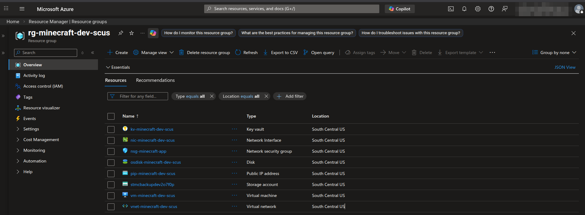
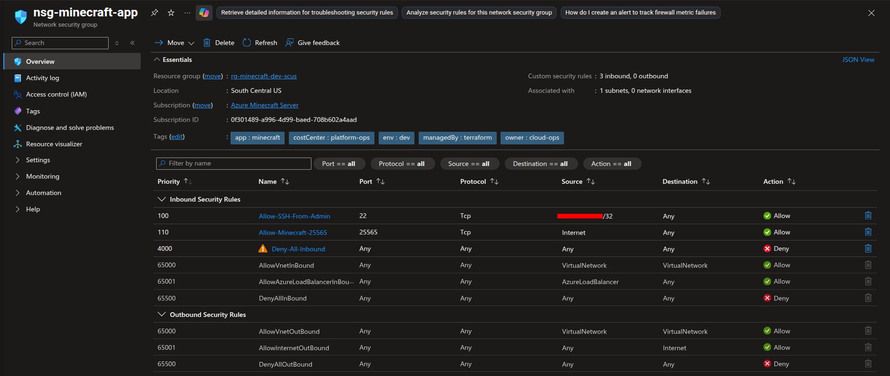
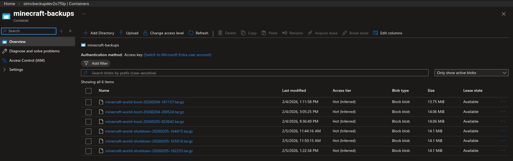
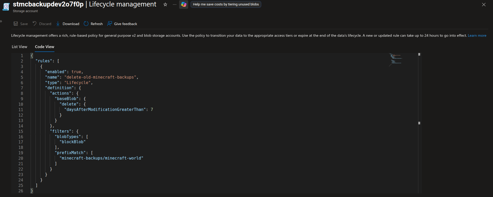
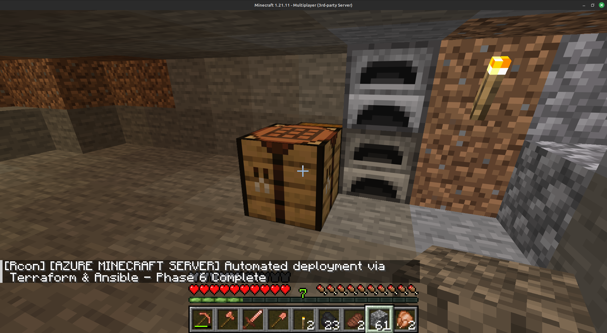

# Azure Minecraft Server - Infrastructure as Code

Automated Minecraft server deployment on Azure using Terraform and Ansible. This project demonstrates infrastructure as code, configuration management, and security best practices in a cloud environment.

## Project Overview

This is a learning project that deploys a production-ready Minecraft server on Azure with:
- Infrastructure provisioning via Terraform
- Configuration management via Ansible
- Multi-layered security (NSG, UFW, fail2ban, SSH hardening)
- Automated security patching with intelligent reboot management
- Automated backups to Azure Blob Storage with lifecycle management
- Cost optimization (deallocate when not in use)

## Competencies Demonstrated

**Cloud Platform:** Azure (IaaS) · Azure CLI · Azure Resource Manager · Azure Key Vault · Azure Blob Storage · Azure Virtual Network · Network Security Groups · Azure Monitor Agent · Log Analytics Workspace

**Infrastructure as Code:** Terraform · HCL · Remote State (Azure Storage Backend) · Modular Design · Resource Tagging · Managed Identity · RBAC

**Configuration Management:** Ansible · Playbooks · Roles · Idempotent Automation · systemd Integration · Jinja2 Templates

**Security:** Defense-in-Depth · NSG Least-Privilege · UFW Host Firewall · fail2ban · SSH Hardening · Zero-Credential Architecture · Key Vault Secret Retrieval via IMDS Token Flow

**Linux & Systems:** Ubuntu 22.04 LTS · Bash Scripting · systemd Services · Log Rotation · Unattended Security Updates · Intelligent Reboot Management

**Operations:** Event-Driven Backups · Lifecycle Policy Automation · Cost Optimization (VM Deallocation) · RCON Automation · Structured Logging

## Architecture

- Cloud Provider: Microsoft Azure
- Region: South Central US
- Compute: Standard_D2as_v6 (2 vCPU, 8 GB RAM, AMD EPYC v6)
- OS: Ubuntu 22.04 LTS
- Network: VNet with NSG, static public IP
- Storage: 30 GB Standard SSD, Azure Blob Storage for backups
- Backup System: Automated boot/shutdown backups with 7-day lifecycle policy
- Secrets: Azure Key Vault with managed identity authentication

## Key Technical Decisions

**Managed Identity over stored credentials for Azure authentication**
All Azure service authentication (Key Vault, Blob Storage) uses the VM's system-assigned managed identity via IMDS token flow. No credentials are stored on the VM, in scripts, or in the repository. This eliminates an entire class of credential exposure risk and mirrors production zero-trust patterns.

**UFW firewall over RCON bind address for RCON security**
Minecraft Java Edition 1.21.11 does not support the `rcon.bind` directive (RCON always binds to `0.0.0.0:25575` regardless of configuration). Rather than relying on an unsupported config directive, UFW default-deny policy blocks external access to port 25575 at the host level. Validated externally via nmap confirming the port is filtered from the internet.

**Event-driven backups over scheduled cron jobs**
Backups trigger on systemd boot and shutdown events rather than a fixed schedule. This ensures a backup is always captured at the most meaningful moments (before startup and after last player activity) regardless of when the VM runs, while boot-time deduplication prevents redundant archives within the same day.

**Intelligent reboot management over simple cron reboots**
Security update reboots query live player count via RCON before acting. Zero players triggers an immediate reboot. Active players receive a 10-minute in-game countdown with progressive warnings before a graceful shutdown. This prevents disrupting active sessions while still ensuring timely security patching on a cost-optimized VM that may run infrequently.

## Project Status

Phase 1 Complete - Foundation established (Jan 20, 2026)
- Remote Terraform state configured in Azure Storage
- Azure provider and subscription configured
- Resource Group deployed with governance tags
- Variables and outputs structure implemented

Phase 2 Complete - Network foundation deployed (Jan 21, 2026)
- VNet and subnet with proper IP addressing (10.10.0.0/16)
- NSG with least-privilege security rules
- Static public IP for consistent server address
- Network module with outputs for VM integration

Phase 3 Complete - Compute deployed and validated (Jan 21, 2026)
- Standard_D2as_v6 VM (2 vCPU, 8 GB RAM, AMD EPYC v6)
- Ubuntu 22.04 LTS with SSH key authentication
- 30 GB Standard SSD OS disk
- Successfully validated SSH access
- Challenge: Overcame Azure capacity constraints through systematic SKU discovery

Phase 4 Complete - OS Hardening with Ansible (Jan 22, 2026)
- Ansible project structure initialized (inventory, playbooks, roles)
- fail2ban intrusion prevention (5 failures = 10min ban)
- Unattended security updates + intelligent reboot management
- UFW firewall (default-deny, SSH rate-limited, Minecraft allowed)
- SSH hardening (root disabled, password auth disabled, key-only)
- Security: Multi-layered defense (NSG + UFW + fail2ban + SSH hardening)
- Operations: Intelligent reboot manager (auto-reboot if no players, countdown if active)

Phase 5 Complete - Minecraft Server and Bug Fixes (Jan 28, 2026)
- Minecraft 1.21.1 server deployed with systemd service
- RCON integration for automated management
- Fixed critical automation bugs (player detection, RCON auth)
- Security validated (RCON protected by UFW firewall)
- Intelligent reboot system operational with player countdown
- All automated scripts tested and validated

Phase 6 Complete - Automated Backup System (Feb 5, 2026)
- Azure Blob Storage integration with managed identity
- Boot backup: Daily at startup (deduplication prevents duplicates)
- Shutdown backup: Every server stop (captures latest gameplay)
- Automated 7-day lifecycle policy for retention management
- Backup testing validated on VM reboot
- systemd integration: ExecStopPost with privilege escalation

## Prerequisites

- Azure subscription with appropriate permissions
- Azure CLI installed and authenticated
- Terraform >= 1.0
- Ansible >= 2.9
- SSH key pair generated

## Quick Start

1. Clone and Configure

git clone https://github.com/Vernaculus/azure-minecraft-server.git
cd azure-minecraft-server/terraform
cp example.tfvars terraform.tfvars
### Edit terraform.tfvars with your values

2. Deploy Infrastructure

terraform init
terraform plan
terraform apply

3. Configure Server (Ansible)

cd ../ansible
### Update inventory/hosts.ini with VM public IP
ansible-playbook playbooks/site.yml

4. Connect to Minecraft

Server address: <VM_PUBLIC_IP>:25565
Add to Minecraft multiplayer server list

## Daily Operations

### Starting the Server

1. Start the VM

az vm start --name vm-minecraft-dev-scus --resource-group rg-minecraft-dev-scus

2. Boot backup runs automatically before Minecraft starts
   - Check backup log: ssh mcadmin@<VM_IP> "sudo tail /var/log/minecraft-backup.log"
   - Deduplication: Only one boot backup per day

3. Check for pending security reboots

ssh mcadmin@<VM_PUBLIC_IP> sudo /usr/local/bin/check-reboot-required

If reboot required:
- No Minecraft running: Automatically reboots
- Minecraft running, no players: Automatically reboots
- Minecraft running with players: 10-minute countdown, then reboots

### Stopping the Server

1. Stop Minecraft gracefully (shutdown backup runs automatically)

ssh mcadmin@<VM_PUBLIC_IP> sudo systemctl stop minecraft

2. Deallocate VM to stop billing

az vm deallocate --name vm-minecraft-dev-scus --resource-group rg-minecraft-dev-scus

### Backup Management

Automated Backups:
- Boot backup: Runs once per day at VM startup (before Minecraft starts)
- Shutdown backup: Runs every time Minecraft stops (captures latest data)
- Retention: Automatically deleted after 7 days via Azure lifecycle policy

View Backups:

az storage blob list \
  --account-name stmcbackupdev2o7f0p \
  --container-name minecraft-backups \
  --auth-mode login \
  --output table

Manual Backup (if needed):

ssh mcadmin@<VM_PUBLIC_IP> "sudo /usr/local/bin/minecraft-backup.sh --event=boot"

Restore from Backup:

# 1. Download backup from Azure
az storage blob download \
  --account-name stmcbackupdev2o7f0p \
  --container-name minecraft-backups \
  --name minecraft-world-shutdown-YYYYMMDD-HHMMSS.tar.gz \
  --file ~/minecraft-backup.tar.gz \
  --auth-mode login

# 2. Stop Minecraft
ssh mcadmin@<VM_PUBLIC_IP> "sudo systemctl stop minecraft"

# 3. Backup current world (safety)
ssh mcadmin@<VM_PUBLIC_IP> "sudo mv /opt/minecraft/world /opt/minecraft/world.old"

# 4. Upload and extract backup
scp ~/minecraft-backup.tar.gz mcadmin@<VM_PUBLIC_IP>:/tmp/
ssh mcadmin@<VM_PUBLIC_IP> "sudo tar -xzf /tmp/minecraft-backup.tar.gz -C /opt/minecraft && sudo chown -R minecraft:minecraft /opt/minecraft/world"

# 5. Start Minecraft
ssh mcadmin@<VM_PUBLIC_IP> "sudo systemctl start minecraft"

### Manual Maintenance Reboot

Schedule reboot with custom countdown (e.g., 5 minutes):

ssh mcadmin@<VM_PUBLIC_IP> sudo /usr/local/bin/scheduled-reboot.sh 5

## Security Features

- Network: NSG (Azure) + UFW (host firewall) with default-deny
- SSH: Key-only authentication, root login disabled, fail2ban active
- Updates: Automated security patching with intelligent reboot management
- Monitoring: fail2ban for intrusion detection, system logs
- RCON: Localhost-only binding, strong password, firewall-blocked from internet
- Backups: Managed identity authentication (no credentials on VM)

## Documentation

- Project Overview - Detailed project plan and requirements
- Prerequisites - Backend setup and configuration
- Networking - Network architecture and NSG rules
- Compute Sizing - VM SKU selection rationale
- Security Architecture - Defense-in-depth strategy and threat model

## Repository Structure

```
azure-minecraft-server/
├── terraform/
│   ├── main.tf                 # Root module orchestration
│   ├── variables.tf            # Input variables
│   ├── outputs.tf              # Output values
│   ├── example.tfvars          # Example configuration
│   └── modules/
│       ├── network/            # VNet, NSG, Public IP
│       ├── compute/            # VM, NIC, Managed Identity
│       ├── storage/            # Blob storage + lifecycle policy
│       └── keyvault/           # Key Vault for secrets
├── ansible/
│   ├── ansible.cfg             # Ansible configuration
│   ├── inventory/
│   │   └── hosts.ini           # VM inventory
│   ├── playbooks/
│   │   └── site.yml            # Main orchestration playbook
│   └── roles/
│       ├── system_hardening/   # Security configuration
│       ├── minecraft_server/   # Server installation
│       └── backup_to_blob/     # Automated backups
└── docs/                       # Project documentation
```

## Cost Optimization

- Deallocate when not in use: Stops compute charges (pay only for storage)
- Standard SSD: Balance of performance and cost
- Single VM: No redundancy needed for personal server
- Estimated Monthly Cost: $50-70 if running 8 hours/day

## Lessons Learned

- Azure capacity constraints require flexible VM sizing strategies
- Infrastructure as code enables rapid rebuild after failures
- Defense-in-depth security is critical for internet-facing servers
- Automated patching requires intelligent scheduling for cost-optimized VMs
- Event-based backups (boot/shutdown) prevent data loss without scheduled jobs

## Roadmap

- **Backup anchor retention** — Implement a protected `latest-known-good` blob prefix
  outside the 7-day lifecycle policy scope. The backup script will copy the most recent
  backup to this prefix on every successful run, ensuring at least one recovery point
  always exists regardless of VM idle duration. The current 7-day rule only targets the
  `minecraft-backups/minecraft-world` prefix and would not affect the anchor blob.

- **Azure Bastion for secure VM management** — Replace direct SSH access (which requires
  maintaining a whitelisted /32 source IP in the NSG) with Azure Bastion, providing
  browser-based SSH access through the Azure portal over TLS 443 with no public port
  exposure. This eliminates the NSG SSH rule entirely, removes the operational burden of
  updating the source IP whitelist when working from different networks, and improves the
  security posture by removing port 22 from the public attack surface.

## Proof of Deployment

All phases were deployed and validated on live Azure infrastructure.

### Resource Group -- Full Stack Provisioned via Terraform

Complete infrastructure stack in a single resource group: VM, VNet, NSG, NIC, Public IP,
OS Disk, Storage Account, and Key Vault -- all provisioned by Terraform with governance
tags confirming IaC-managed resources.



### NSG Rules -- Least-Privilege Network Security

Custom inbound rules enforce a default-deny posture: SSH restricted to a single admin /32
source IP (priority 100), application port open to Internet (priority 110), all other
inbound traffic explicitly denied (priority 4000). Tags confirm managedBy: terraform.



### Azure Blob Storage -- Automated Backups Running

Six backup archives captured across boot and shutdown events, confirming both triggers fire
correctly. Naming convention (minecraft-world-boot-YYYYMMDD-HHMMSS and
minecraft-world-shutdown-YYYYMMDD-HHMMSS) confirms event-driven deduplication is working
as designed.



### Blob Lifecycle Policy -- Automated 7-Day Retention

Auto-delete lifecycle policy scoped to the minecraft-backups/minecraft-world prefix,
targeting blockBlob type only. Policy enforced at the storage account level with a 7-day
daysAfterModificationGreaterThan rule.



### End-to-End Validation -- Live Deployment via Terraform and Ansible

Successful connection to the running server with RCON broadcasting the automated deployment
completion message, confirming the full automation chain: Terraform infrastructure
provisioning --> Ansible configuration management --> systemd service --> RCON automation.



## Contributing

This is a personal learning project. Feel free to fork and adapt for your own use.

## License

MIT License - See LICENSE file for details

## Contact

Josh Hall - Vernaculus on GitHub

